# User Authentication App

A React Native application with complete Login and Signup functionality, built using React Context API for authentication state management, React Navigation for screen routing, and AsyncStorage for persistent sessions.

---

## Features

- **Login** — Authenticate with email and password, with field validation and credential error handling
- **Signup** — Register a new account with name, email, and password
- **Home Screen** — Displays the logged-in user's name and email with a logout button
- **Persistent Session** — Users remain logged in after closing and reopening the app (AsyncStorage)
- **Form Validation** — Inline error messages for missing fields, invalid email format, and short passwords
- **Password Visibility Toggle** — Eye icon to show/hide password input

---

## Tech Stack

| Library | Version | Purpose |
|---|---|---|
| React Native | 0.85.2 | Mobile framework |
| React | 19.2.3 | UI library |
| TypeScript | ^5.8 | Type safety |
| React Navigation | ^7.0 | Screen navigation |
| AsyncStorage | ^1.24 | Persistent storage |
| React Native Safe Area Context | ^5.0 | Safe area handling |

---

## Project Structure

```
src/
├── context/
│   └── AuthContext.tsx     # Global auth state (login, signup, logout, user)
├── navigation/
│   └── AppNavigator.tsx    # Stack navigator — auth guard logic
└── screens/
    ├── LoginScreen.tsx     # Login form
    ├── SignupScreen.tsx    # Signup form
    └── HomeScreen.tsx      # Logged-in user dashboard
```

---

## Prerequisites

Make sure your development environment is set up for React Native:

- [Node.js](https://nodejs.org/) >= 22.11.0
- [React Native CLI environment](https://reactnative.dev/docs/set-up-your-environment)
- **Android:** Android Studio + Android SDK
- **iOS (macOS only):** Xcode + CocoaPods (`gem install cocoapods`)

---

## Setup & Installation

### 1. Clone the repository

```sh
git clone <your-repo-url>
cd UserAuthenticationApp
```

### 2. Install dependencies

```sh
npm install
```

### 3. iOS only — install CocoaPods

```sh
npm run pods
```

---

## Running the App

### Start Metro bundler

```sh
npm start
```

> Use `npm run start:reset` to start with a clean cache if you encounter module resolution issues.

### Android

```sh
npm run android
```

### iOS

```sh
npm run ios
```

---

## Build for Production

### Android — debug APK

```sh
npm run android:build
```

Output: `android/app/build/outputs/apk/release/app-release.apk`

### Android — release mode on device

```sh
npm run android:release
```

### Android — JS bundle only

```sh
npm run android:bundle
```

### iOS — release configuration

```sh
npm run ios:release
```

---

## Other Useful Scripts

| Script | Description |
|---|---|
| `npm run type-check` | Run TypeScript type checking |
| `npm run lint` | Run ESLint |
| `npm run format` | Format `src/` files with Prettier |
| `npm run clean` | Clean build cache and artifacts |
| `npm test` | Run Jest unit tests |

---

## Authentication Flow

1. **First launch** — User lands on the Login screen
2. **No account?** — Navigate to Signup, fill in Name / Email / Password (min. 6 chars), tap Signup
3. **Login** — Enter registered email and password, tap Login
4. **Home** — User info is displayed; tap Logout to end the session
5. **Reopen app** — Session is restored automatically from AsyncStorage

### Validation Rules

| Field | Rules |
|---|---|
| Email | Required, must match valid email format |
| Password | Required, minimum 6 characters (Signup) |
| Name | Required (Signup only) |

---

## Demo Video

https://github.com/user/UserAuthenticationApp/assets/videos/demo.mp4

> If the video does not play inline, [download demo.mp4](assets/videos/demo.mp4).

---

## Screenshots

### Login Screen

<table>
  <tr>
    <td align="center"><b>Empty Form</b></td>
    <td align="center"><b>Validation Error</b></td>
    <td align="center"><b>Incorrect Credentials</b></td>
  </tr>
  <tr>
    <td>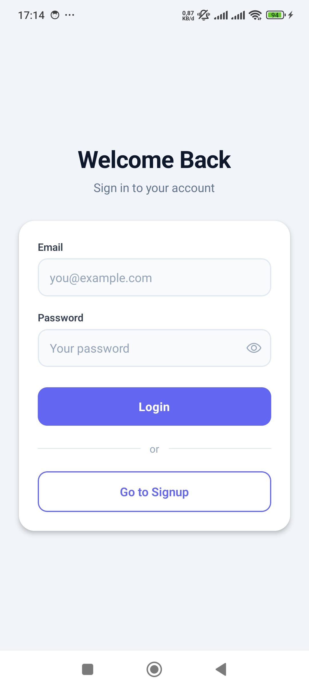</td>
    <td>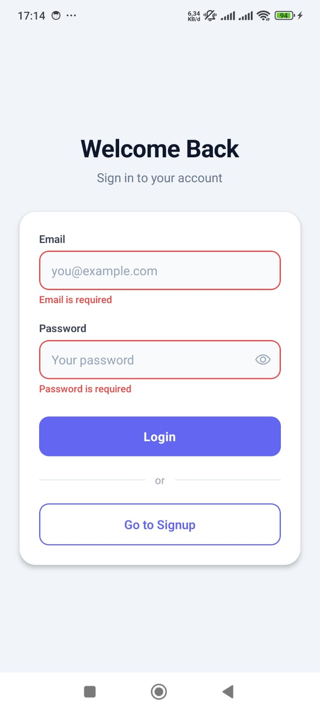</td>
    <td>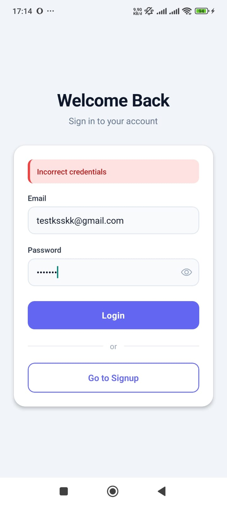</td>
  </tr>
  <tr>
    <td align="center"><b>Password Hidden</b></td>
    <td align="center"><b>Password Visible</b></td>
    <td></td>
  </tr>
  <tr>
    <td>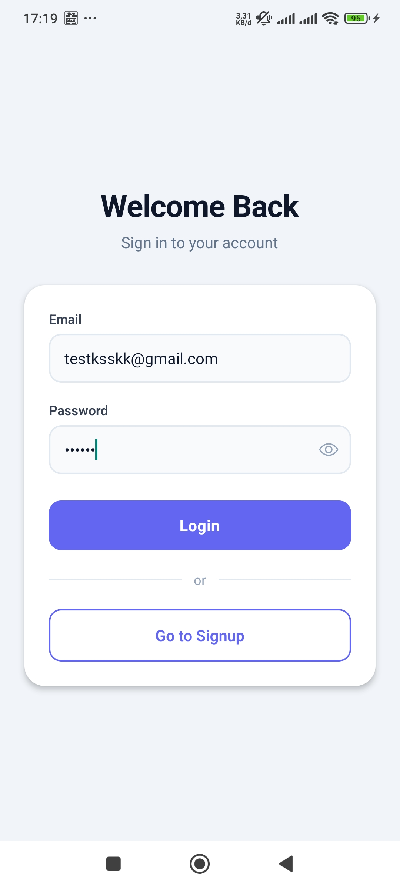</td>
    <td>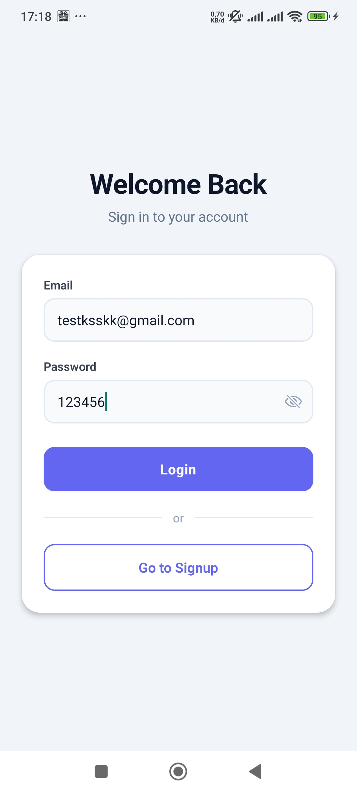</td>
    <td></td>
  </tr>
</table>

### Signup Screen

<table>
  <tr>
    <td align="center"><b>Empty Form</b></td>
    <td align="center"><b>Validation Error</b></td>
    <td align="center"><b>Email Already Registered</b></td>
  </tr>
  <tr>
    <td>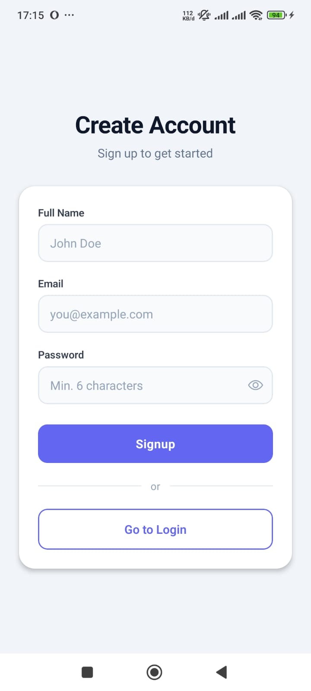</td>
    <td>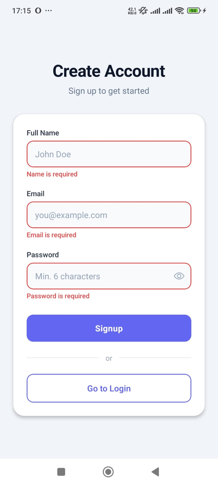</td>
    <td>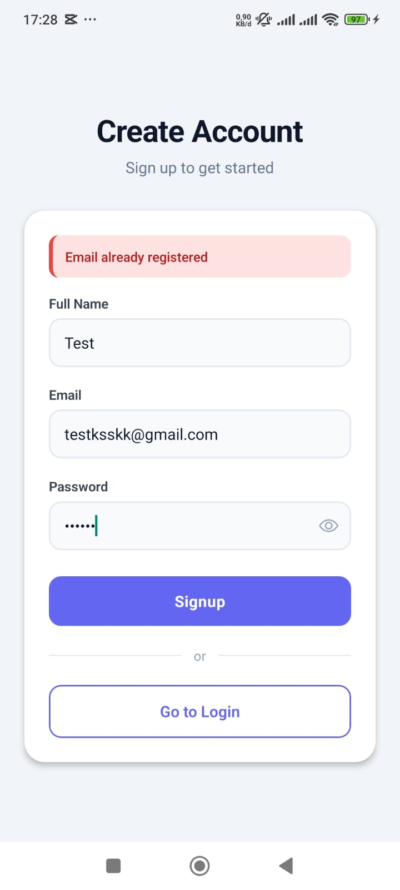</td>
  </tr>
  <tr>
    <td align="center"><b>Password Hidden</b></td>
    <td align="center"><b>Password Visible</b></td>
    <td></td>
  </tr>
  <tr>
    <td>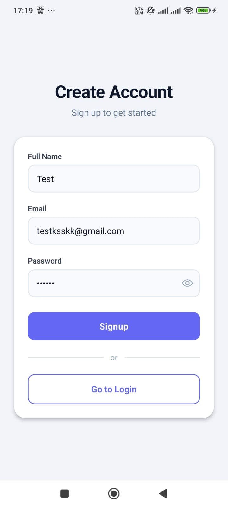</td>
    <td>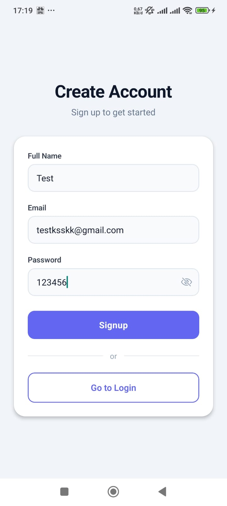</td>
    <td></td>
  </tr>
</table>

### Home Screen

<table>
  <tr>
    <td align="center"><b>Success Login</b></td>
  </tr>
  <tr>
    <td>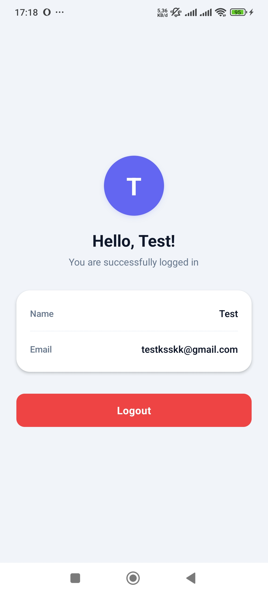</td>
  </tr>
</table>

---

## License

This project is for educational purposes.
